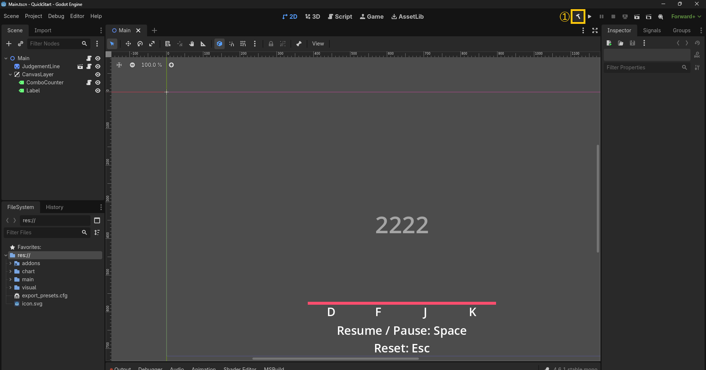
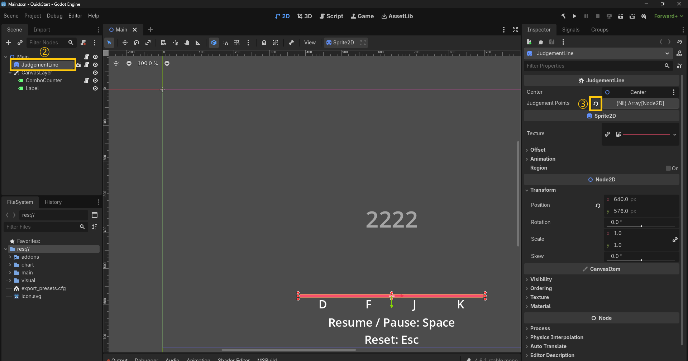
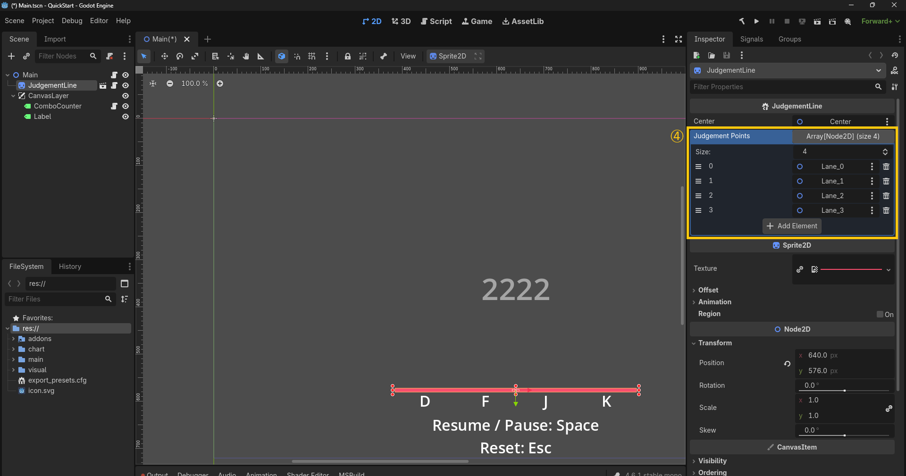
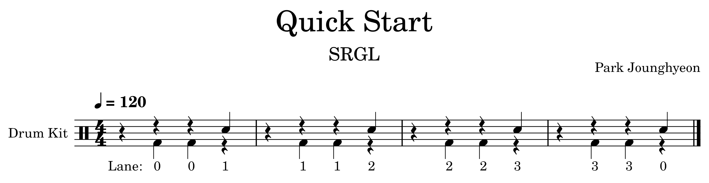
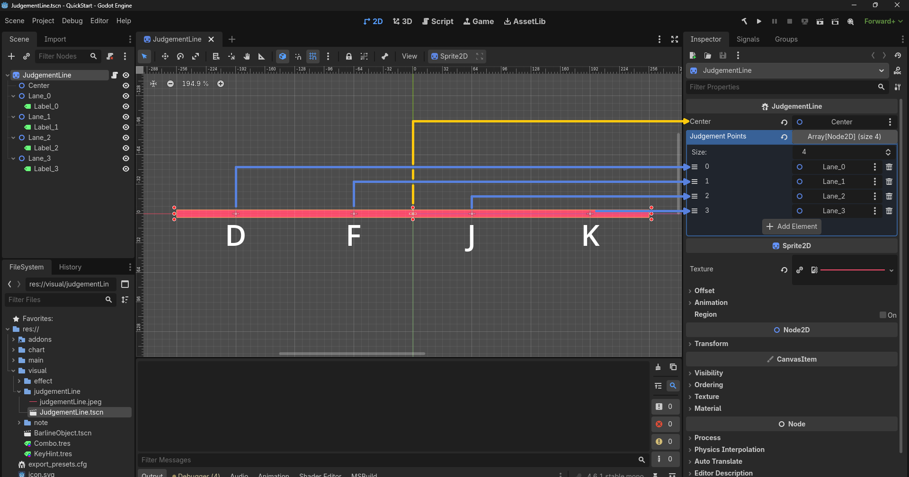
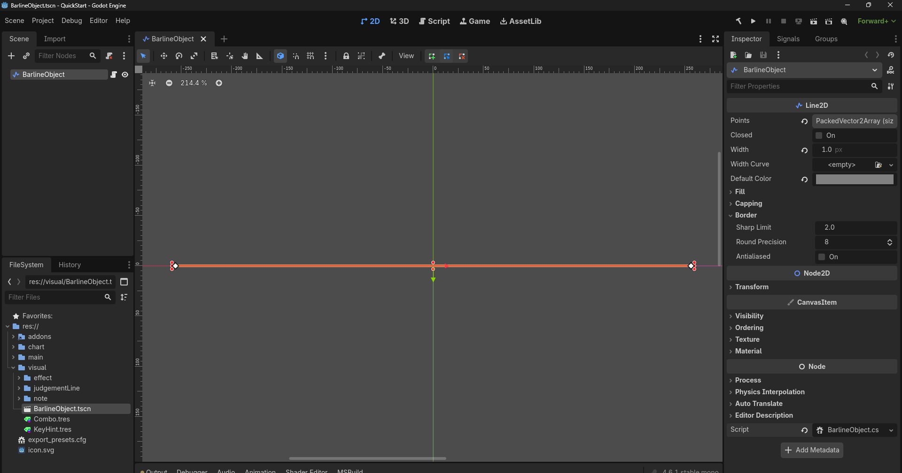
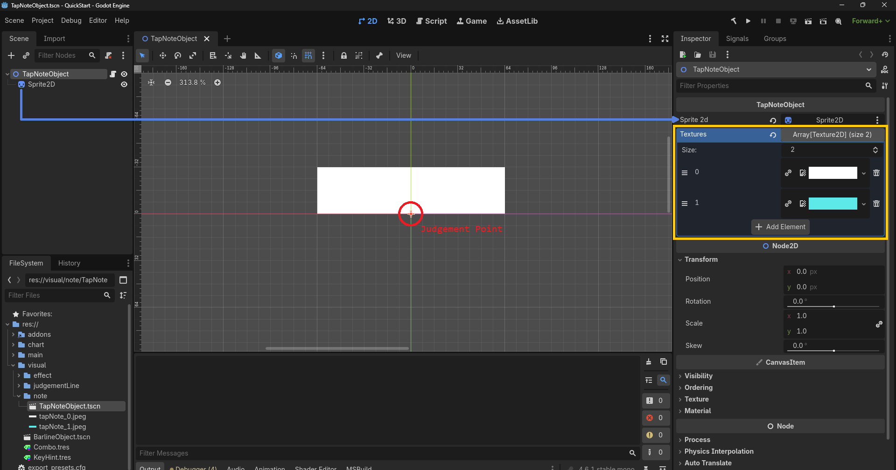
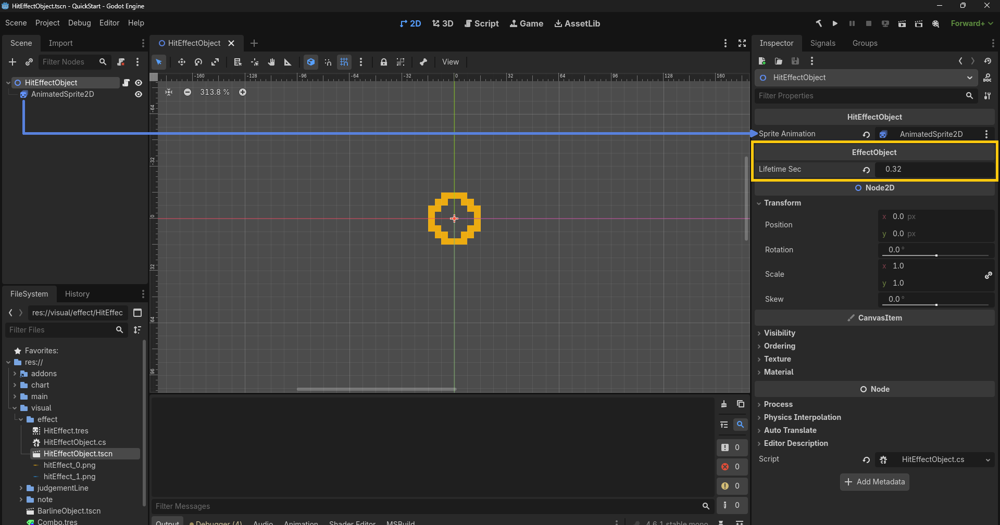
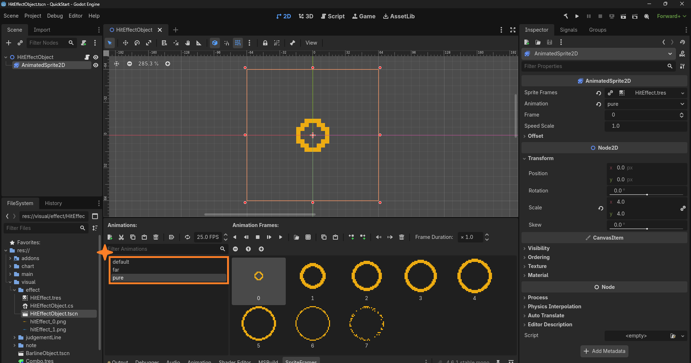
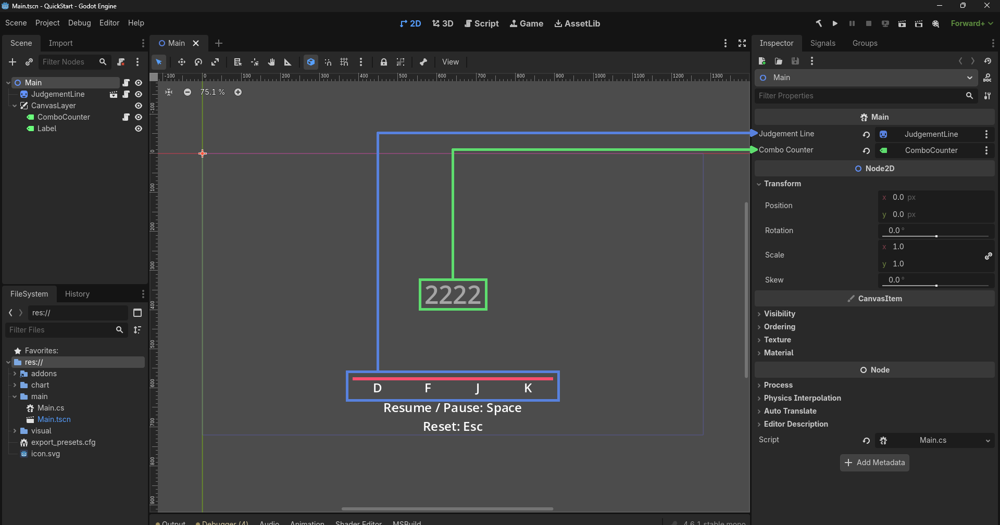

# 🎵 Simple Rhythm Game Library (SRGL)
Other Languages: [한국어](./README.ko.md)

SRGL is a **Godot 4.6 (.NET)** based keyboard rhythm game library.  
It is specialized for creating casual Vertical Scrolling Rhythm Games (VSRG).  
Currently supports 2D only.

## 📖 Table of Contents
- [✨ Features](#-features)
- [🛠️ Installation](#️-installation)
- [🚀 Quick Start](#-quick-start)
- [🎼 Chart File Structure](#-chart-file-structure)
- [📄 License](#-license)

## ✨ Features
- Complete separation of game logic and visuals.
- Uses JSON format for chart files.
- Automatically generates long note ticks and barlines based on time signatures.
- Supports basic scroll velocity (SV) changes and stop effects.
- Automatically compensates for audio drift every frame.
- Highly customizable timing windows, input systems, user offsets, and scroll speeds.
- Easily add custom judgement logic for different note types via the `IJudgementStrategy` interface.
- Design visual elements effortlessly with `JudgementLine`, `NoteObject`, and `EffectObject` classes.

## 🛠️ Installation

### (a) Installing SRGL
SRGL is a C# script-based library.  
Clone it into a subdirectory of your **Godot 4.6 (.NET)** project.
```bash
git clone https://github.com/joung2321/SRGL.git
```

### (b) Building the QuickStart Demo
To build the [QuickStart](./demo/QuickStart/) demo project, you need to create a symbolic link.
```cmd
REM Windows
mklink /J SRGL\demo\QuickStart\addons SRGL\addons
```
```bash
# Linux
# [CAUTION] Untested command
ln -s SRGL/addons SRGL/demo/QuickStart/addons
```
Open the QuickStart's [project.godot](./demo/QuickStart/project.godot) in the editor and modify it as follows:
1. Build the project.
2. Select the JudgementLine node in [Main.tscn](./demo/QuickStart/main/Main.tscn).
3. In the Inspector, click the 🔄️ icon next to Judgement Points.
4. Verify that an array of size 4 is restored.
<p>



</p>

## 🚀 Quick Start
This section covers how to implement a simple 4-key rhythm game.  
For more details, refer to the [demo/QuickStart](./demo/QuickStart/) project.

### 1. Prepare Audio File
Prepare an audio file for the sheet music below. OGG format is recommended.  
This example uses [quickStart.ogg](./demo/QuickStart/chart/quickStart.ogg).

**⚠️Note:** If you are using MuseScore, you must re-export the generated audio to OGG using Audacity so that Godot 4.6 can load the file properly.

### 2. Create Chart File
Create [quickStart.json](./demo/QuickStart/chart/quickStart.json) to use as the chart file.  
For more details, see the [Chart File Structure](#-chart-file-structure) section.
```json
{
	"FormatVersion": "1.0.0",
	"Title": "",

	"AudioPath": "res://chart/quickStart.ogg",

	"PPQN": 10,
	"EndOfTrack": 320,
	"LaneCount": 4,
	"OffsetUsec": 2000,

	"Tempos":         [ {"s":0, "b":120} ],
	"TimeSignatures": [ {"s":0, "n":4, "d":4} ],
	"SvChanges":      [ {"s":0, "m":1} ],

	"Notes":
	[
		{"s":10, "l":0},
		{"s":20, "l":0},
		{"s":30, "l":1},

		{"s":50, "l":1},
		{"s":60, "l":1},
		{"s":70, "l":2},

		{"s":90,  "l":2},
		{"s":100, "l":2},
		{"s":110, "l":3},

		{"s":130, "l":3},
		{"s":140, "l":3},
		{"s":150, "l":0}
	]
}
```

### 3. Design Visual Elements

#### a) Judgement Line, Barlines, and Notes
Design
[JudgementLine.tscn](./demo/QuickStart/visual/judgementLine/JudgementLine.tscn),
[BarlineObject.tscn](./demo/QuickStart/visual/BarlineObject.tscn), and
[TapNoteObject.tscn](./demo/QuickStart/visual/note/TapNoteObject.tscn) using the built-in classes provided by SRGL:
- [`JudgementLine.cs`](./addons/SRGL/graphics/JudgementLine.cs)
- [`BarlineObject.cs`](./addons/SRGL/standard/BarlineObject.cs)
- [`TapNoteObject.cs`](./addons/SRGL/standard/TapNoteObject.cs)
<p>



</p>

#### b) Effects
SRGL does not provide default derived classes for [`EffectObject.cs`](./addons/SRGL/graphics/EffectObject.cs).  
You need to write [`HitEffectObject.cs`](./demo/QuickStart/visual/effect/HitEffectObject.cs) and design [HitEffectObject.tscn](./demo/QuickStart/visual/effect/HitEffectObject.tscn).
```csharp
using Godot;

using SRGL;
using SRGL.Common;

public partial class HitEffectObject : EffectObject
{
    [Export] private AnimatedSprite2D _spriteAnimation;

    protected override void OnPlay(Judgement judgement)
    {
        _spriteAnimation.Stop();

        switch(judgement.PartitionIndex)
        {
            case 0:
            case 1:
            _spriteAnimation.Play("pure");
            break;

            case 2:
            _spriteAnimation.Play("far");
            break;

            default:
            _spriteAnimation.Play("default"); // empty animation
            break;
        }
    }
}
```
<p>


</p>

### 4. Write Gameplay Logic
Write [`Main.cs`](./demo/QuickStart/main/Main.cs). For demonstration purposes, we also add a [`ComboCounter`](./addons/SRGL/misc/ComboCounter.cs).
```csharp
using Godot;

using SRGL;
using SRGL.Common;
using SRGL.Standard;
using SRGL.Misc;

public partial class Main : Node
{
    [Export] private JudgementLine _judgementLine;
    [Export] private ComboCounter _comboCounter;

    // logic
    private SongPlayer _sp;
    private JudgementQueue _jq;
    private LogicManager _lm;

    // visual
    private NoteManager _nm;
    private EffectManager _em;

    public override void _Ready()
    {
        // ======== logic ========
        // load chart
        RawChart rc = RawChartLoader.Load("res://chart/quickStart.json");
        Chart c = new Chart(rc);

        // load song
        _sp = new SongPlayer(this);
        _sp.LoadSong(c.AudioPath);

        // define timing window (reference: Arcaea)
        TimingWindow tw = new TimingWindow(120 * 1_000); // radius of timing window (lost: 100 ~ 120 [ms])
        tw.Partition(25 * 1_000); // pure (exact)
        tw.Partition(50 * 1_000); // pure
        tw.Partition(100 * 1_000); // far

        // define judgement logic
        _jq = new JudgementQueue(c.LaneCount, tw);
        _jq.AddStrategy(0, new TapNoteJudgementStrategy());

        // define key map
        StandardInputMapper sim = new StandardInputMapper();
        sim.AssignKey(Key.D, 0);
        sim.AssignKey(Key.F, 1);
        sim.AssignKey(Key.J, 2);
        sim.AssignKey(Key.K, 3);

        // user offset [us]
        long userOffsetUsec = 0;

        // create game logic
        _lm = new LogicManager(c, _sp, _jq, sim, userOffsetUsec);
        AddChild(_lm);

        // ======== visual ========
        // note pool
        _nm = new NoteManager(_judgementLine, VisualVariationSelector.Select4K, 32);
        _nm.AddNoteType(Constants.BarlineVisualType, "res://visual/BarlineObject.tscn", 8);
        _nm.AddNoteType(0, "res://visual/note/TapNoteObject.tscn", 16);
        _nm.UserSpeedPxPerSec = 500;

        _nm.Listen(_jq, _lm);

        // effect pool
        _em = new EffectManager(_judgementLine);
        _em.AddEffectType(TapNoteJudgementStrategy.CONTEXT_HIT, "res://visual/effect/HitEffectObject.tscn", 4);

        _em.Listen(_jq);

        // ======== misc ========
        // combo counter
        _comboCounter.ComboBreakPartitionIndex = tw.GetLastPartitionIndex();
        _jq.NoteJudged += _comboCounter.OnNoteJudged;
    }

    public override void _UnhandledKeyInput(InputEvent @event)
    {
        if(@event is InputEventKey ek && ek.Pressed && !ek.Echo)
        {
            // resume and pause
            if(ek.Keycode == Key.Space)
            {
                if(_sp.Playing) { _sp.Pause(); }
                else { _sp.Resume(); }
            }

            // reset gameplay
            if(ek.Keycode == Key.Escape)
            {
                _lm.Reset();
                _comboCounter.Reset();
            }
        }
    }
}
```

### 5. Design Gameplay Scene
Attach `Main.cs` to the root node of [Main.tscn](./demo/QuickStart/main/Main.tscn). Place [JudgementLine.tscn](./demo/QuickStart/visual/judgementLine/JudgementLine.tscn) and a `Label` node for the `ComboCounter` to complete the gameplay scene.


## 🎼 Chart File Structure
SRGL uses JSON formatted chart files.

### (a) Metadata
|Key|typeof(Value)|Description|Default|
|-|-|-|-|
|FormatVersion|string|File format version<br>(Parsable by `System.Version`)|
|Title|string|Title of the track|""|
|Composer|string|Composer|""|
|Illustrator|string|Illustrator|""|
|Charter|string|Chart creator|""|
|DifficultyCategory|int|Difficulty category<br>e.g., Easy = 0, Normal = 1, Hard = 2|
|DifficultyLevel|float|Difficulty level<br>e.g., 7.8, 9.4, 10.9|
|Description|string|Description|""|

### (b) Chart Data
|Key|typeof(Value)|Description|
|-|-|-|
|ImagePath|string|Album cover image file path|
|AudioPath|string|Audio file path|
|PPQN|long|Pulses Per Quarter Note<br>(Number of `ticks` per quarter note)|
|EndOfTrack|long|Range for generating barlines (Unit: `ticks`)|
|LaneCount|int|Number of lanes|
|OffsetUsec|long|Chart start offset relative to the audio file (Unit: `us`)|
|Tempos|RawTempo[]|BPM changes|
|TimeSignatures|RawTimeSignature[]|Time signature changes|
|SvChanges|RawSvChange[]|Scroll velocity changes|
|Notes|RawNote[]|Note data|

### (c) RawTempo: BPM Changes
|Key|Abbr.|typeof(Value)|Description|
|-|-|-|-|
|StartTick|S|long|BPM change point (Unit: `ticks`)|
|Bpm|B|double|BPM value|

### (d) RawTimeSignature: Time Signature Changes
|Key|Abbr.|typeof(Value)|Description|
|-|-|-|-|
|StartTick|S|long|Time signature change point (Unit: `ticks`)|
|Numerator|N|int|Numerator of the time signature|
|Denominator|D|int|Denominator of the time signature|

### (e) RawSvChange: Scroll Velocity (SV) Changes
|Key|Abbr.|typeof(Value)|Description|Default|
|-|-|-|-|-|
|StartTick|S|long|SV change point (Unit: `ticks`)|
|Multiplier|M|double|Scroll speed multiplier (Normal speed = 1.0)|
|Interpolation|I|[InterpolationType](./addons/SRGL/common/Enums.cs)|SV interpolation method<br>0 = `Step`: No interpolation<br>1 = `Linear`: Linear interpolation<br>2 = `Impulse`: Stop scrolling|0 = `Step`|

### (f) RawNote: Note Data
|Key|Abbr.|typeof(Value)|Description|Default|
|-|-|-|-|-|
|StartTick|S|long|Note start point (Unit: `ticks`)|
|EndTick|E|long|Note end point (Unit: `ticks`)<br>(For Long notes: `StartTick` < `EndTick`)|
|Lane|L|int|Lane index|
|LogicType|J|int|Type of judgement logic<br>(Corresponds to the `logicType` parameter in `JudgementQueue.AddStrategy()`)|0|
|VisualType|V|int|Type of note object<br>(Corresponds to the `visualType` parameter in `NoteManager.AddNoteType()`)|0|
|TickRate|T|int|Splits 1 (`Denominator`)-th note into `TickRate` segments when generating long note ticks|
|NoteOptions|O|[NoteOptions](./addons/SRGL/common/Enums.cs)|Additional options per note<br>1 << 0 = `Dummy`: Dummy note<br>~~1 << 1 = `AllowHoldAgain`: Can re-hold a missed long note~~<br>~~1 << 2 = `CheckRelease`: Enable release judgement~~|0|

## 📄 License
SRGL is released under the MIT License.